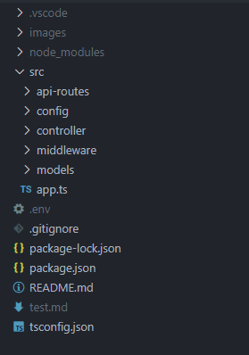
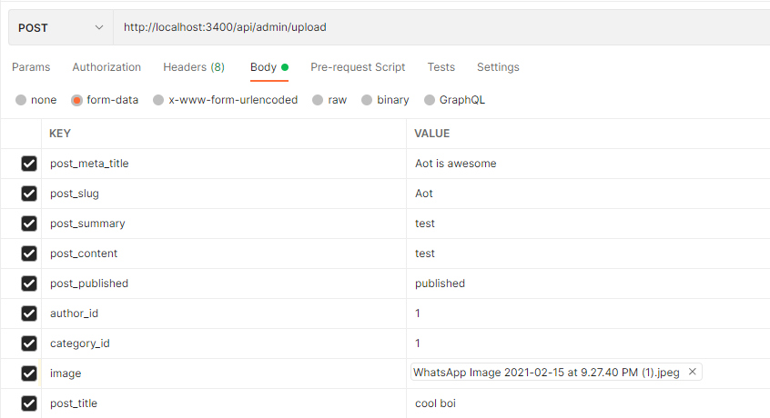
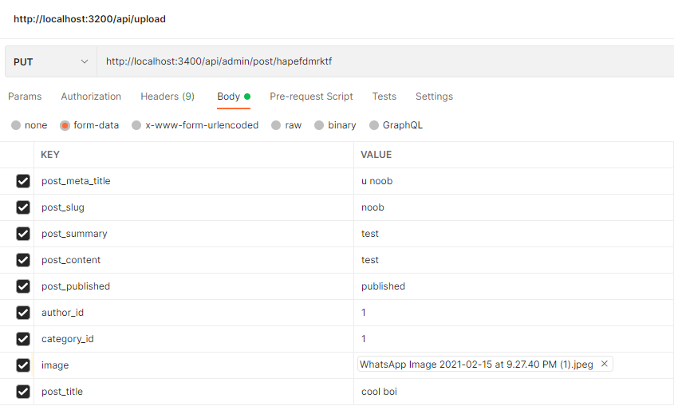
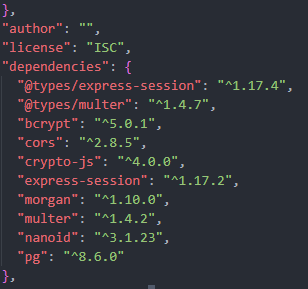

## Introduction

<p>Blog API made with typescript, express & PostgreSQL with all the basic features and more !</p>

### Technologies

- Nodejs
- Expressjs
- Typescript
- PostgreSQL

&nbsp;

## File Structure



## Basic commands

```bash
git clone https://github.com/leoantony72/blog_api
```

```bash
npm install
```

&nbsp;

### PostgreSQL Setup

<p>You have to install Postgres Yourself🙃</p>

<p>Start Postgres server❗</p>

```postgres
sudo service postgresql start
```

&nbsp;

<p>After installing get into postgres CLI</p>

```POSTGRES
CREATE DATABASE blog; //This will create the database
```

&nbsp;

<p>Next we have to setup TABLES❗</p>

```POSTGRES
\C blog //this will take you inside blog db
```

&nbsp;

<p>Copy tables From blogapi.sql file(src->models->blog_api.sql)❗</p>

```POSTGRES
\i FILE PATH
```

&nbsp;

<P>OR YOU CAN COPY/PASTE FROM blogapi.sql</p>

```POSTGRESQL
CREATE TABLE users(
    userid VARCHAR(11) NOT NULL PRIMARY KEY,
    username VARCHAR(50) NOT NULL,
    passwordHash text NOT NULL,
    user_role VARCHAR(25) NOT NULL,
    sessionid text ,
    registeredAt TIMESTAMP NOT NULL
);

CREATE INDEX idx_userid ON users(userid);

CREATE TABLE authors(
    id VARCHAR(11) NOT NULL PRIMARY KEY,
    username VARCHAR(50),
    profile_image BYTEA NULL
);

CREATE TABLE post(
    post_id VARCHAR(11) NOT NULL PRIMARY KEY,
    title VARCHAR(100) NOT NULL,
    meta_title VARCHAR(100) NULL,
    slug VARCHAR(100) NOT NULL UNIQUE,
    summary VARCHAR(100) NULL,
    content TEXT NULL DEFAULT NULL,
    published VARCHAR(20) NULL,
    publishedAt TIMESTAMP NOT NULL,
    author_id VARCHAR(11) NULL REFERENCES authors(id)
    ON DELETE CASCADE
    ON UPDATE CASCADE
);

CREATE TABLE savedpost(
    id VARCHAR(11) NOT NULL PRIMARY KEY,
    userid VARCHAR(11) NOT NULL REFERENCES users(userid)
    ON DELETE CASCADE
    ON UPDATE CASCADE,
    post_id VARCHAR(11) NOT NULL REFERENCES post(post_id)
    ON DELETE CASCADE
    ON UPDATE CASCADE
);

CREATE TABLE category(
    id VARCHAR(11) NOT NULL PRIMARY KEY,
    title VARCHAR(75) NOT NULL,
    meta_title VARCHAR(100) NULL DEFAULT NULL,
    slug VARCHAR(100) NOT NULL
);

CREATE INDEX idx_category_parent on category(id);

CREATE TABLE post_category(
    post_id VARCHAR(11) NOT NULL REFERENCES post(post_id)
    ON DELETE CASCADE
    ON UPDATE CASCADE ,
    category_id VARCHAR(11) NOT NULL REFERENCES category(id)
    ON DELETE CASCADE
    ON UPDATE CASCADE
);
CREATE INDEX idx_post_post ON post_category(post_id ASC);
CREATE INDEX idx_post_category ON post_category(category_id ASC);


```

<p>WITH THIS DB SETUP IS FINISHED😸</p>
&nbsp;

## Setting Up .ENV File😈

<P>These are the env variabes of database❗</P>

```ENV
PORT = 3000
DB_USER = test
DB_PASSWORD = password
DB_HOST = localhost
DB_PORT = 5432
DB_DATABASE = blog
SESSION_SECRET = secret for session //use a strong one
SESSION_MAXAGE = 3600000 * 60 * 10
GMAIL_USER = example
GMAIL_PASS = password
```

&nbsp;

### Image Folder

<p>Create images Folder in Root dir, Inside Images Folder create post_banner Folder❗</p>

&nbsp;

### Start Server❗

```SERVER
npm run dev -L //RUNNNING IN LOCALHOST:3000
```

<P>The Server is now Running✔</P>

&nbsp;

# Api Routes

<p>GET POSTS</p>

```ROUTES
http://localhost:3000/api/posts //get all posts
```

&nbsp;

<p>GET POST BY ID</p>

```ROUTES
http://localhost:3000/api/post/:id //get post by ID
```

&nbsp;

<p>GET POST BY CATEGORY</p>

```routes
http://localhost:3000/api/posts/category/:category //get post by category
```

&nbsp;

<p>GET POST BY AUTHOR</p>

```ROUTES
http://localhost:3000/api/posts/author/leo //get post by author name
```

&nbsp;

## REGISTER/LOGIN/LOGOUT (POST request) 🔥

- <p>Register User🙍‍♀️</p>

```ROUTES
http://localhost:3000/api/auth/register
```

```JSON
{
  "username": "example",
  "email": "example@gmail.com",
  "password": "password183$",
  "confirmpassword": "password183$"//password are hashed before storing in db
}
```

&nbsp;

- Login User

```routes
http://localhost:3000/api/auth/login  //Login users
```

```JSON
{
  "username":"Leoantony72",
  "password":"test1234"
}
```

&nbsp;

- Logout Users

```ROUTES
http://localhost:3000/api/logout
```

&nbsp;

- Forgot Password

```ROUTES
http://localhost:3000/api/auth/forgotpassword
```

```JSON
{
    "success": "Email Sent"
}
```

Sends 📧 to provided user, Also checks if user exist in db
&nbsp;

# User Roles

```JSON
USER AND ADMIN
```

<P>Users cannot create posts,updatepost etc... , Only Admin users can Create post & modify post</P>

<p>By default role is USER ,After registering a user you need go to db to change Role to ADMIN  ❗❗</p>

<P>⭕I RECOMMEND USING POSTBIRD (GUI) It is simple to use </P>
&nbsp;

# Create New Post & Modify

USE POSTMAN FOR TESTING❗

- New post (post req)

```Routes
http://localhost:3000/api/admin/upload //create new post
```

<P>WE ALSO HAVE TO UPLOAD IMAGE SO CHOOSE *FORM DATA* IN POSTMAN ❗❗ </P>



```json
{
  "post_id": "hapefdmrktf" //IF SUCCESS IT WILL RETURN A POSTID
}
```

&nbsp;

- Update Post (PUT req)

```routes
http://localhost:3000/api/admin/post/hapefdmrktf //update post
```



```json
"post updated" //if success you will get this
```

&nbsp;

- Delete Post (DELETE req)

```routes
http://localhost:3000/api/admin/post/hapefdmrktf //Delete post by post ID
```

```json
"post deleted" //if success you will get this
```

&nbsp;

# Search Post

<p>Search post by title/meta title</p>

```routes
http://localhost:3000/api/search/attack on titan //Search post by post ID
```

```JSON
{
        "post_id": "itlfosfntlj",
        "title": "cool boi",
        "meta_title": "attack on titan\r\n",
        "slug": "testfgggfgr",
        "summary": "res",
        "content": "rser",
        "published": "published",
        "publishedat": "2021-07-19T06:02:55.380Z",
        "author_id": "1",
        "image": "1626674575348.jpeg"
    }
```

&nbsp;

# Save Post

you need to login to use this feature

- Add saved post (POST req)

```routes
http://localhost:3000/api/savedpost/itlfosfntlj //save post
```

```json
{
  "success": "Post saved" // if success you will get this
}
```

&nbsp;

- Delete saved post (DELETE req)

```routes
http://localhost:3000/api/savedpost/:id //delete saved post
```

```json
{
  "success": "Post deleted" // if success you will get this
}
```

&nbsp;

- Get saved post (GET req)

```routes
http://localhost:3000/api/savedpost //Get saved post
```

```json
//you will get the post if success
[
  {
    "post_id": "7383e359ddb",
    "title": "cool boi",
    "meta_title": "leo",
    "slug": "nofsea",
    "summary": "testsef",
    "content": "test",
    "published": "published",
    "publishedat": "2021-08-04T22:34:30.985Z",
    "author_id": "1",
    "image": "1628116470935.jpeg"
  }
]
```

## Some Additional Info


<h5>
<p>- Added Forgot Password</p>
<p>- included session & cookies</p>
<p>- Email verification,if not verified you cannot login</p>
<p>- You can only upload .png/.jpg/.jpeg file below 5mb ❗</p>
<p>- Passwords and tokens are hashed & stored in database</p>
<p>- Added input Validation in Login/register/forgotpassword</p>
</h5>

- <b>Dependencies</b>



## This marks the end of the documentaion...

Any future updates and additional info will be added
